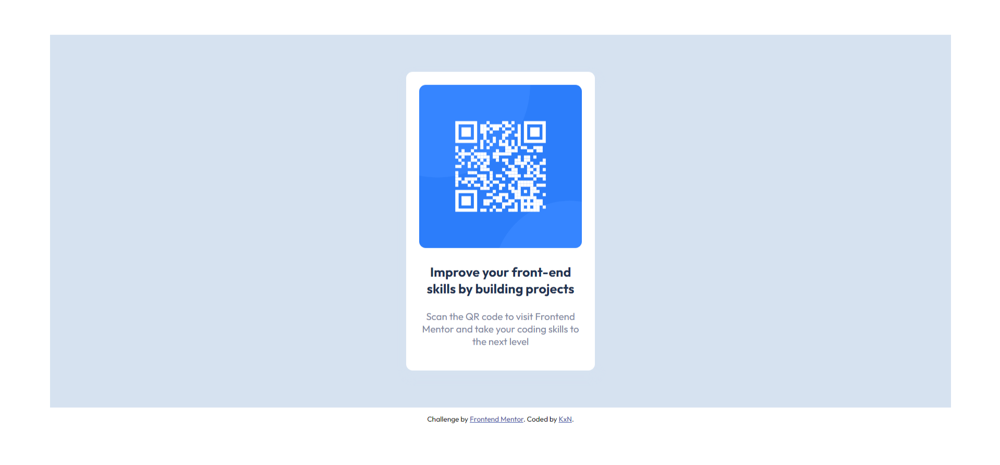

# Frontend Mentor - QR code component solution

This is a solution to the [QR code component challenge on Frontend Mentor](https://www.frontendmentor.io/challenges/qr-code-component-iux_sIO_H). Frontend Mentor challenges help you improve your coding skills by building realistic projects. 

## Table of contents

- [Overview](#overview)
  - [Screenshot](#screenshot)
  - [Links](#links)
  - [Built with](#built-with)
  - [What I learned](#what-i-learned)
  - [Continued development](#continued-development)
  - [Useful resources](#useful-resources)
- [Author](#author)

**Note: Delete this note and update the table of contents based on what sections you keep.**

## Overview

A simple qr component scanner design

### Screenshot

### Links

- Solution URL: [Add solution URL here](https://https://github.com/kxn69/qr-code-component)
- Live Site URL: [Add live site URL here](https://kxn69.github.io/qr-code-component/)

### Built with

- Semantic HTML5 markup
- CSS custom properties
- CSS Grid
- [Google Font - Outfit](https://fonts.google.com/specimen/Outfit) - For styles

### What I learned

While working on this project, I learnt some new colors lol, and also equipped my knowledge on box shadows

### Continued development

I'd like to continue harnessing more css knowledge to be better equipped with styling and making better user interface designs

### Useful resources

- [w3schools](https://www.w3schools.com/) - This helped me have more knowledge to box shadows

## Author

- Frontend Mentor - [@kxn69](https://www.frontendmentor.io/profile/kxn69)
- Twitter - [@ayokxnmi](https://www.twitter.com/ayokxnmi)
